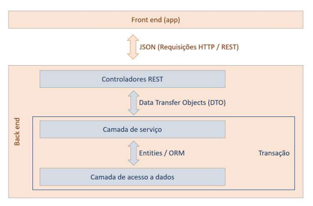
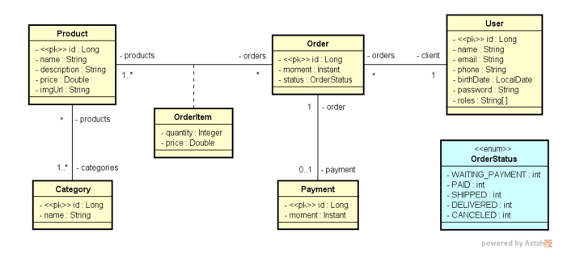
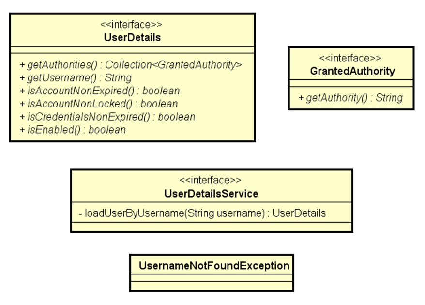

# DSCommerce - Sistema de E-commerce

O **DSCommerce** é uma API RESTful desenvolvida para gerenciar as operações de um sistema de e-commerce. O projeto abrange desde o catálogo de produtos e categorias até o processo de carrinho de compras e registro de pedidos, contando com um sistema robusto de autenticação e autorização utilizando OAuth2 e JWT.

## 🚀 Tecnologias Utilizadas

O projeto foi desenvolvido com as seguintes tecnologias e práticas:

* **Java 21**
* **Spring Boot 3+**
* **Spring Data JPA** (Mapeamento Objeto-Relacional)
* **Spring Security & OAuth2 Authorization Server** (Autenticação e Autorização com JWT e Custom Password Grant)
* **H2 Database** (Banco de dados em memória para testes)
* **Maven** (Gerenciamento de dependências)
* **Validation** (Validação de dados de entrada)

## ⚙️ Funcionalidades

* **Catálogo de Produtos:** Consulta paginada, busca por nome e CRUD completo de produtos (restrito a administradores).
* **Gestão de Categorias:** Listagem de categorias disponíveis.
* **Gestão de Pedidos:** Registro de novos pedidos com múltiplos itens, cálculo automático de totais e consulta de pedidos por ID.
* **Autenticação e Segurança:** * Login via token JWT (OAuth2).
    * Controle de acesso por perfis (`ROLE_ADMIN` e `ROLE_CLIENT`).
    * Proteção de rotas sensíveis a nível de método (`@PreAuthorize`).
* **Tratamento de Exceções:** Respostas padronizadas para erros de validação, recursos não encontrados, problemas de banco de dados e acessos negados.

---

## 🏗️ Arquitetura do Sistema

O sistema foi estruturado seguindo o padrão de **Arquitetura em Camadas** (Layered Architecture), garantindo a separação de responsabilidades entre controladores, serviços, repositórios e entidades.



---

## 📊 Diagramas

### Modelo Conceitual
Abaixo está a representação do modelo de domínio, mostrando a estrutura das entidades, seus atributos e os relacionamentos do sistema.



### Modelo de Segurança (UserDetails)
Estrutura de modelagem dos usuários e perfis de acesso garantindo a segurança da aplicação.



---

## 📄 Documentação de Requisitos

A documentação completa com as especificações, regras de negócio e requisitos do sistema pode ser acessada no arquivo PDF em anexo:

[🔗 Acessar Documentação de Requisitos PDF](docs/requisitos.pdf)

---

## 🛣️ Principais Endpoints da API

**Autenticação:**
* `POST /oauth2/token` - Autenticação e geração do Token JWT.

**Usuários:**
* `GET /users/me` - Retorna os dados do usuário logado.

**Produtos:**
* `GET /products` - Lista produtos paginados (com suporte a busca por `name`).
* `GET /products/{id}` - Busca produto por ID.
* `POST /products` - Insere um novo produto (Admin).
* `PUT /products/{id}` - Atualiza um produto existente (Admin).
* `DELETE /products/{id}` - Deleta um produto (Admin).

**Categorias:**
* `GET /categories` - Lista todas as categorias.

**Pedidos:**
* `GET /orders/{id}` - Busca pedido por ID (Admin ou dono do pedido).
* `POST /orders` - Registra um novo pedido (Cliente).

---

## 📮 Testando a API (Postman)

Para facilitar o teste de todos os endpoints, disponibilizamos uma workspace pública no Postman. 

A coleção já está configurada com as **variáveis de ambiente** necessárias (como a URL base e o controle automático do Token JWT para requisições autenticadas), pronta para uso.

[🔗 Acessar Coleção do Postman - DSCommerce](https://www.postman.com/prc201/workspace/dscommerce/collection/41258303-7d25e829-9d32-4eeb-8ea9-bdec5920e945?action=share&creator=41258303&active-environment=41258303-02b2238f-d2e1-4a3b-adbc-2aa7731f3bbe)

**Dica de uso:** Certifique-se de selecionar o ambiente (Environment) correto no canto superior direito do Postman ao importar ou acessar a collection, para que as variáveis sejam carregadas corretamente.

---

## 🛠️ Como Executar o Projeto

### Pré-requisitos
* Java 21 instalado
* Maven instalado (ou usar o Wrapper do projeto: `./mvnw`)
* Git

### Passos

1. Clone o repositório:
   ```bash
   git clone https://github.com/EduPRC/dscommerce.git
   ```
2. Acesso a pasta do projeto:
   ```bash
   cd dscommerce
   ```
3. Instale as dependências e compile o projeto:
   ```bash
   ./mvnw clean install
   ```
4. Execute a aplicação:
   ```bash
   ./mvnw spring-boot:run
   ```

#### A aplicação estará disponível em http://localhost:8080.
#### O banco de dados H2 pode ser acessado em http://localhost:8080/h2-console
#### (credenciais padrão definidas no application-test.properties).

---

# 👨‍💻 Autor
## Eduardo Canos

[](https://www.linkedin.com/in/eduardo-canos-58690a267)
